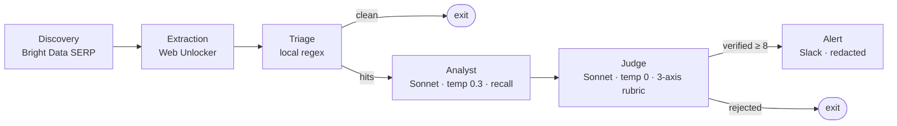

# LeakGuard

**An autonomous agent that patrols public paste sites for leaked credentials and triages
them down to a single verified, redacted Slack alert — usually before the exposed key is
indexed by Google.**

🔗 **Live demo:** **https://leakguard.streamlit.app** &nbsp;·&nbsp; 🏆 Bright Data **Web Data
UNLOCKED** — Track 3: Security & Compliance

> The live demo is a read-only dashboard over a **synthetic** snapshot (fabricated eval
> fixtures, every credential redacted). Opening it does **not** run the agent or consume
> Bright Data credits — the page says so itself.

---

## For judges — the 30-second version

- **What it is.** Most security tooling watches *your* systems. LeakGuard watches the
  *external* paste surface — where credentials actually leak — and decides which exposures
  are worth waking a human for. The verb is **triage, not scan**: every alert has already
  been judged.
- **Why it's credible.** Across a locked 22-fixture eval, run 3× back-to-back:

  | Metric | Result | Target |
  |---|---|---|
  | **Precision** | **100%** (±0%) | ≥ 80% ✅ |
  | **False-positive rate** | **0%** (±0%) | < 5% ✅ |
  | Recall | 73% (±16%, range 55–82%) | — |

  **When LeakGuard fires, it is right.** Recall jitter is reported honestly — it's structural
  threshold-cliff behaviour (a few real leaks sit right on the verify line), not a defect.
  The rubric and threshold are **spec-locked** in [`docs/eval-runs.md`](docs/eval-runs.md).
- **Why Bright Data is load-bearing.** The paste surface fights back — bot detection, rate
  limits, dynamic rendering. Without Bright Data the agent is blind. See
  [Bright Data usage](#bright-data--track-3) below; a live SERP round-trip is captured in
  [`docs/screenshots/friday-live-bright-data.md`](docs/screenshots/friday-live-bright-data.md).

## Pipeline



Every path ends at an **audit** node that writes one redacted JSON record per paste, so the
dashboard and the alert history are reconstructable after the fact.

## Why two LLMs

Separation of concerns is the core design choice — two models, two temperatures, two jobs
([ADR-0001](docs/adr/0001-two-llm-analyst-judge.md)):

- **Analyst — recall gate.** Claude Sonnet 4.6 at `temp 0.3`. Over-flags on purpose; at this
  stage a false negative is the enemy.
- **Judge — precision gate.** Claude Sonnet 4.6 at `temp 0`. Applies a strict three-axis
  rubric — **target authenticity · secret entropy & validity · exposure context** — and only
  a total `score ≥ 8` fires an alert. The Judge never reproduces a secret verbatim.

The cheap **local regex triage** runs first so the LLMs only ever see candidates that already
have a pattern hit — keeping cost and latency down.

## Security — the check must never become the leak

A leak-detection tool that echoes the leak is worse than useless. Redaction is enforced at
**every boundary** that leaves the pipeline — Slack alert, audit log, dashboard — with the
credential replaced by `[…last4, len=N]` before any artifact is written
([ADR-0003](docs/adr/0003-defense-in-depth-redaction.md)). The committed demo snapshot is
fully synthetic and was scanned for raw secrets before publishing; the repo also runs a
`detect-secrets` pre-commit hook.

## Bright Data — Track 3

Bright Data is what turns "I have a regex" into "I have an agent operating on the live,
adversarial paste surface."

| Stage | Bright Data product | Zone |
|---|---|---|
| **Discovery** | SERP API (`brd_json=1`) | `leakguard_serpapi` |
| **Extraction** | Web Unlocker | `web_unlocker_leakguard` |

> **Integration gotcha (captured the hard way):** the SERP zone defaults to raw HTML, so
> `format: "json"` alone returns 0 organic results. You must append **`brd_json=1`** to the
> Google URL and read `r.json()["organic"]` (see [`nodes/discovery.py`](nodes/discovery.py)).
> A live run confirmed 10 organic Pastebin results on `leakguard_serpapi`.

Development ran against a **local mock paste server** to protect the $250 credit cap — mock
for dev, live for the demo round-trip. That ordering is deliberate.

## Setup

```bash
python3 -m venv .venv && source .venv/bin/activate
pip install -r requirements.txt
cp .env.example .env   # then fill in real values
pre-commit install     # enable the detect-secrets hook
```

Required env vars (`.env`): `ANTHROPIC_API_KEY`, `BRIGHTDATA_API_KEY`,
`BRIGHTDATA_UNLOCKER_ZONE`, `BRIGHTDATA_SERP_ZONE`, `SLACK_WEBHOOK_URL`
(LangSmith vars optional — see [Tracing & privacy](#tracing--privacy)).

## Run

```bash
python mock_server/server.py        # serve synthetic pastes on :8080 (safe demo)
python graph.py                     # run the pipeline against /paste/001
streamlit run dashboard/app.py      # live dashboard at localhost:8501
python tests/run_eval.py            # score the 22-fixture eval set (precision/recall/FPR)
```

## Tracing & privacy

LangSmith captures the **full prompt** sent to Claude — which for LeakGuard includes raw paste
content, secrets and all. `LANGSMITH_TRACING` is **off by default** and should be enabled
**only** for runs against the synthetic fixtures. Never enable it against real paste data —
that would ship live credentials to a third-party store, the exact exposure LeakGuard exists
to catch. The env toggle is the real switch (it also disables LangGraph node-state tracing);
the per-node client wrap is a backstop.

## Status

The pipeline runs **end-to-end** — extraction, regex triage, the two-LLM Analyst/Judge,
conditional routing, the redacted Slack alert, and the audit log are all implemented and
tested.

- **Live discovery is proven:** a supervised Bright Data SERP round-trip returned 10 organic
  Pastebin results (captured in
  [`docs/screenshots/friday-live-bright-data.md`](docs/screenshots/friday-live-bright-data.md)).
- **The end-to-end demo runs against the local mock paste server** to protect the credit cap;
  extraction is wired to the Bright Data Web Unlocker zone for live operation.

## Structure

```
nodes/         discovery · extraction · triage · analyst · judge · alert
prompts/       analyst_system.md · judge_system.md
audit/         writer.py (one redacted JSON record per paste)
dashboard/     app.py (Streamlit) + demo_audit_log.jsonl (synthetic snapshot)
mock_server/   server.py + pastes/ (synthetic fixtures for safe demos)
tests/         node + smoke tests; seeded_pastes/ (22-fixture eval set)
docs/          adr/ · eval-runs.md (locked baseline) · deploy-checklist.md
state.py       typed LeakGuardState
graph.py       LangGraph wiring + scheduler entry point
keywords.yaml  watchlist (hot-reloads)
```

See [`PRD-LeakGuardAgent-v0.2.md`](PRD-LeakGuardAgent-v0.2.md) for the full spec and
[`docs/adr/`](docs/adr/) for the key design decisions.
