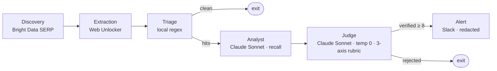

# LeakGuard Agent

An autonomous agent that patrols public paste sites for leaked credentials and personal
data, running a three-stage triage funnel that ends in a verified Slack alert — usually
before the exposed key is indexed by Google.

Built for the Bright Data **Web Data UNLOCKED** hackathon (Track 3: Security & Compliance).
See `PRD-LeakGuardAgent-v0.2.md` for the full spec, and `docs/adr/` for key design decisions.

## Pipeline



- **Discovery** (Bright Data SERP API) — Google dorks (`site:pastebin.com "keyword"`) → candidate URLs.
- **Extraction** (Bright Data Web Unlocker) — fetch raw paste content.
- **Triage** (local regex) — cheap pre-filter; drops the obvious noise.
- **Analyst** (Claude Sonnet, recall-tuned) — flags anything that could be a leak.
- **Judge** (Claude Sonnet, temp 0) — strict three-axis rubric; only `score >= 8` alerts.
- **Alert** (Slack webhook) — redacted, with audit reasoning. Everything is logged.

## Structure

```
nodes/         discovery · extraction · triage · analyst · judge · alert
prompts/       analyst_system.md · judge_system.md
dashboard/     app.py (Streamlit, reads audit_log.jsonl)
mock_server/   server.py + pastes/ (synthetic fixtures for safe demos)
tests/         node + smoke tests; seeded_pastes/ (Day-3 eval set)
state.py       typed LeakGuardState
graph.py       LangGraph wiring + scheduler entry point
keywords.yaml  watchlist (hot-reloads)
```

## Setup

```bash
python3 -m venv .venv && source .venv/bin/activate
pip install -r requirements.txt
cp .env.example .env   # then fill in real values
pre-commit install     # enable the detect-secrets hook
```

Required env vars (`.env`): `ANTHROPIC_API_KEY`, `BRIGHTDATA_API_KEY`,
`BRIGHTDATA_UNLOCKER_ZONE`, `BRIGHTDATA_SERP_ZONE`, `SLACK_WEBHOOK_URL`
(LangSmith vars optional).

## Run

```bash
python mock_server/server.py        # serve synthetic pastes on :8080 (safe demo)
python graph.py                     # run the pipeline
streamlit run dashboard/app.py      # live dashboard
```

> **Bright Data note:** the SERP zone returns parsed organic results only when the
> Google URL includes `brd_json=1` (see `nodes/discovery.py`). Rehearse against the
> mock server, not live SERP, to protect the $250 credit cap.

## Status

Pipeline runs **end-to-end**. Discovery (live SERP) is the only stub — demos run against the
local mock server to protect the credit cap. Extraction, triage, the two-LLM Analyst/Judge,
conditional routing, and the redacted Slack alert are implemented and tested, with LangSmith
tracing. Credentials are redacted in two layers before any alert leaves the box (see
`docs/adr/0003`).
